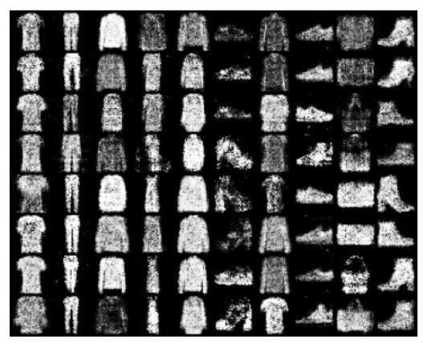

# Generative Models

This repository contains implementations of several generative models, including VAE, GAN, Conditional GAN, Diffusion Models, and Conditional Diffusion Models.

## Results

<h3 align="center">Fashion MNIST</h3>

  

<h3 align="center">Conditional Diffusion Model</h3>

  
  

<h3 align="center">Diffusion Model</h3>

  
  

<h3 align="center">Conditional GAN</h3>

  

<h3 align="center">GAN</h3>

  
  

<h3 align="center">VAE</h3>

  
  

## Requirements

To run the scripts in this repository, you will need to have the following dependencies installed:

- Python 3
- PyTorch
- NumPy
- Matplotlib
- tqdm

## Models

### VAE

The Variational Autoencoder (VAE) is a generative model that learns a latent representation of the input data and uses it to generate new data samples.

### GAN

The Generative Adversarial Network (GAN) is another popular generative model that consists of a generator and a discriminator network. The generator learns to generate realistic data samples, while the discriminator learns to distinguish between real and fake samples.

### Conditional GAN

The Conditional Generative Adversarial Network (cGAN) extends the GAN by conditioning the generation process on additional information, such as class labels. This allows the user to generate images from a specific class or with specific attributes.

### Diffusion Models

Diffusion models are a class of generative models that learn to simulate the diffusion process of a stochastic system.

### Conditional Diffusion Models

The Conditional Diffusion Models extend the Diffusion Models by conditioning the generation process on additional information, such as class labels.
